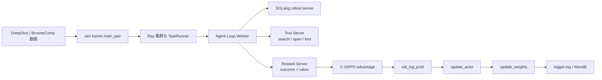
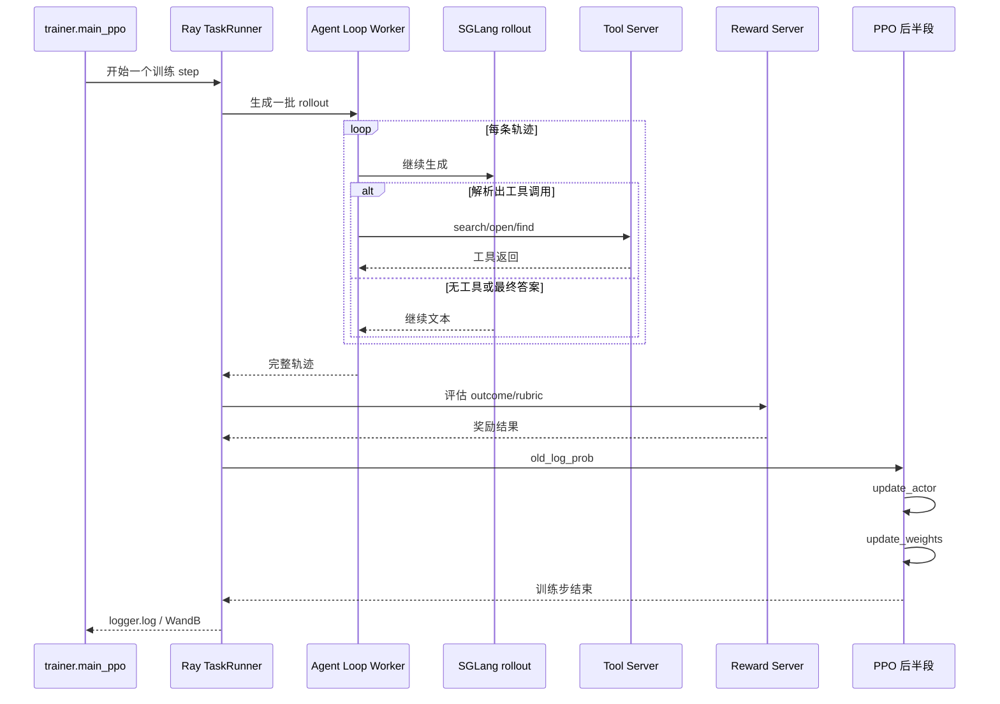

# CaRR DeepSearch 项目复盘（2026-03-12）

> 面向读者：对多轮工具调用智能体（agent）、强化学习（Reinforcement Learning, RL）和强化学习基础设施都还不熟的新手。  
> 本文目标：解释这次项目为什么“技术上已经跑通”，但“成本仍然失控”；为什么过去很多配置不行；为什么唯一稳定的 `b4/n4, tensor parallel size = 1` 仍然非常贵；以及下一轮最该先改什么。

## 写在前面：先看四个结论

> **结论 1**：CaRR 论文的方法主链路已经被工程化跑通。  
> 这不是“代码从头到尾都错了”的项目；工具、奖励、`verl` 的 `agent loop`、自定义 C-GRPO（Citation-aware Group Relative Policy Optimization）优势函数都已经接上了。
>
> **结论 2**：当前成本失控的主因不是“模型塞不进显存”，而是长轨迹、多轮工具调用、外部接口延迟和同步栅栏叠加。  
> 这是一个“系统吞吐结构”问题，不是单个组件“坏掉”。
>
> **结论 3**：`b16/n8` 不是“理论上错误”，而是在当前实现里不经济。  
> 它要求每一步处理的 rollout 数太多；在当前单 tool server、单 reward server、无全局缓存、并发控制有限的实现下，最长的那批轨迹会被放大成整步 wall time。
>
> **结论 4**：`b4/n4, tensor parallel size = 1` 是第一套已验证稳定、能明确打出 `step:1` 的训练口径，但不是正式经济配方。  
> 它的价值是“证明当前链路终于能稳定完成一个训练步”，不是“证明可以直接拿它跑完整正式训练”。

---

## 目录

1. [本文怎么读：证据等级与常见误判](#本文怎么读证据等级与常见误判)
2. [项目目标、论文目标与当前项目目标](#项目目标论文目标与当前项目目标)
3. [给新手的基础知识：什么是 agentic 强化学习](#给新手的基础知识什么是-agentic-强化学习)
4. [当前实现与论文实现的对齐状态](#当前实现与论文实现的对齐状态)
5. [为什么会失败：按系统阶段组织，而不是按日期](#为什么会失败按系统阶段组织而不是按日期)
6. [为什么成本失控：这是全文重点](#为什么成本失控这是全文重点)
7. [为什么 `b16/n8` 不是“显存够了就该更快”](#为什么-b16n8-不是显存够了就该更快)
8. [为什么 `b4/n4, tensor parallel size = 1` 是唯一稳定口径，但仍然不经济](#为什么-b4n4-tensor-parallel-size--1-是唯一稳定口径但仍然不经济)
9. [论文配置为什么当前无法经济移植到本实现](#论文配置为什么当前无法经济移植到本实现)
10. [未来该怎么改：按优先级，不按想法罗列](#未来该怎么改按优先级不按想法罗列)
11. [对外叙事：如何把它写成简历项目](#对外叙事如何把它写成简历项目)
12. [证据索引](#证据索引)
13. [术语表](#术语表)

---

## 本文怎么读：证据等级与常见误判

这篇复盘里会频繁出现“日志”“trace”“probe”“gate”“step:1”这类实验术语。为了避免把本来就复杂的训练系统讲得更乱，先约定三种证据等级。

### 证据等级

| 等级 | 含义 | 本文如何使用 |
| --- | --- | --- |
| 硬证据 | 本地文档或已下载日志里有直接数字、日志行或结果文件 | 可以直接下结论 |
| 强推断 | 多个硬证据支持同一个解释，但没有单条日志把这句话原样写出来 | 可以写成“高度支持”“强烈说明” |
| 未验证 | 目前只有合理猜测，没有完成对应验证 | 只能写成下一轮建议，不能写成结论 |

### 四个最容易误导新手的现象

#### 1. “没看到 `step:1`”不一定代表 PPO（Proximal Policy Optimization）卡死

过去几轮 `1-step probe` 里，一个特别容易误判的点是：日志里没有出现 `step:1`，很多人就会立即说“后半段卡住了”。

这句话只有在下面三个条件**同时成立**时才够硬：

- `trainer.val_before_train=false`
- `trainer.test_freq=0`
- `trainer.save_freq=0`

原因是：在 `verl` 里，最后一步会不会先做 validation（验证）和 save（保存 checkpoint），不只取决于“是不是每 99 步才测一次”，还取决于“当前是不是最后一步”。如果你在 `1-step probe` 里把 `test_freq` 和 `save_freq` 设成一个很大的正数，比如 `9999`，它们仍然会在最后一步被触发。

这正是为什么后来我们专门引入了 **clean probe（干净探针）** 的概念：  
只有显式设置 `trainer.val_before_train=false`、`trainer.test_freq=0`、`trainer.save_freq=0` 的 probe，才能拿来判断“训练步本身有没有完成”。

#### 2. `task_unfinished=True` 时，reward server 会直接 short-circuit 为零分

另一个极容易误判的点是：看到 DeepSeek 控制台几乎没有调用，或者 reward trace 里出现大量 `evaluate_short_circuit`，就以为“奖励服务器坏了”。

真实情况是：

- 如果一个 rollout（一次完整轨迹）到达了限制条件，比如：
  - assistant turn（助手回合数）上限
  - response length（响应长度）上限
  - 某些格式错误导致没有收束成最终答案
- agent loop 会把这个样本标记成 `task_unfinished=True`
- reward server 在收到这种样本时，不会去调用 judge（判分模型），而是直接返回 `0`

所以：

- “reward 没有工作”  
  很多时候并不是真的 reward server 没工作，而是它**很快地做出了“这条轨迹没有完成任务，因此不给分”的判定**。

#### 3. reward trace 里要先扣掉 health check，才能统计真实样本

`run_rl.sh` 和 `run_eval.sh` 在启动 tool server 和 reward server 之后，都会先发送几条健康检查请求。它们常常长这样：

- 用户问题是一个非常短的占位文本，比如 `q`
- `task_unfinished` 直接是 `true`

这些请求的目的只是验证服务端起来了，不是正式训练样本。

因此，读 reward trace 时要先把 health check 扣掉，再去数：

- 真实 `evaluate_result`
- 真实 `evaluate_short_circuit`
- 真实 reward 均值

#### 4. `test_freq=9999` 与 `save_freq=9999` 在 `1-step probe` 里并不等于“关闭”

这是前面第一个误判的具体来源，值得再强调一次：

- 在普通长期训练里，`9999` 可能看起来像“几乎不会触发”
- 但在 `1-step` 情况下，“最后一步”本身就是特殊条件

所以：

- 对长期训练：`9999` 可以近似理解为“很少触发”
- 对 `1-step probe`：`9999` 不是关闭，而是**仍会在最后一步触发**

---

## 项目目标、论文目标与当前项目目标

### 这个项目在做什么

这次项目的目标，是把 CaRR 论文里的“带浏览器工具的多轮搜索智能体”落到 `verl` 上做训练和评估。

这个智能体不是普通的一问一答模型，而是一个会反复执行下面循环的 agent：

1. 先思考
2. 决定是否调用工具
3. 用工具搜索网页、打开网页、在网页中查找片段
4. 再根据新观察继续思考
5. 最后输出一个带证据和最终答案的回答

最终回答不是自由发挥，而是必须遵守固定结构：

- `## Explanation with Citations`
- `## Exact Answer`
- `## References`

CaRR 的核心创新也不只是“答对就加分”，而是：

- 先判断最终答案对不对
- 再判断它是否真的找到了问题中隐藏的关键实体
- 再判断这些实体是否被网页证据支持
- 再判断这些支持过的事实是否真正连到了最终答案

这意味着它训练的是一种更接近“深度搜索（deep search）”的能力，而不是简单猜答案。

### 论文给出的目标配置

根据 [Carr_paper_data.md](./Carr_paper_data.md) 的整理，论文里最关键的配置如下。

#### 监督微调（Supervised Fine-Tuning, SFT）

- backbone（基础模型）：`Qwen3-4B-Thinking-2507`
- 数据：从 DeepDive 的 SFT split 中做 reject sampling（拒绝采样）后得到的 `832` 条高质量 traces
- 训练轮数：`3 epochs`
- batch size：`16`
- learning rate：`4e-5`
- maximum context length：`128k`

#### 强化学习（Reinforcement Learning, RL）

- 使用 DeepDive RL split 全部 `2,234` 条问题
- `16 prompts × 8 samples`
- global batch size：`128`
- temperature：`1.0`
- learning rate：`2e-6`
- maximum context length：`64k`
- 训练轮数：`3 epochs`
- rubric reward 权重 `alpha = 0.3`

### 当前项目目标

当前项目的目标并不是“在第一次实验里完全经济复现论文主表”，而是三层目标并行：

1. **方法复现**  
   把论文的方法主线用 `verl` agent loop 和自定义 C-GRPO 优势函数跑通。

2. **系统验证**  
   证明工具、奖励、Ray、SGLang、`verl`、远端多卡环境之间可以形成完整闭环。

3. **可讲述的简历项目**  
   形成一个“方法 + 系统 + 成本诊断”的完整项目，而不是只堆一个训练命令。

### 表：论文目标 vs 当前实现

| 项目项 | 论文设定 | 当前实现 | 差异影响 | 是否阻塞正式复现 |
| --- | --- | --- | --- | --- |
| SFT backbone | `Qwen3-4B-Thinking-2507` | `Qwen/Qwen3-4B` | 策略起点与论文不同，较可能带来更长轨迹与更高 unfinished | 是 |
| SFT 数据 | reject sampling 后 `832` 条高质量 traces | 数据来源与论文公开提供的 SFT 数据一致；当前本地使用的是同一数据集转换得到的 parquet | 数据源本身不是当前主要差异，真正差异在 backbone、上下文长度与早期工程处理口径 | 否 |
| SFT 上下文长度 | `128k` | 当前主线是 `64k/65k` 级训练 | 长轨迹 SFT 能力不完全等价 | 是 |
| RL 并发口径 | `16 prompts × 8 samples` | 当前稳定口径是 `b4/n4, TP1` | 训练强度和吞吐结构不同 | 是 |
| 工具 | `search/open/find` | 已对齐 | 主链路一致 | 否 |
| `open` 输出 | 前 `10k chars` | 已对齐 | 工具行为一致 | 否 |
| `find` 行为 | 字符串匹配 | 接口对齐，但当前实现是“精确匹配 + 模糊匹配” | 论文口径需谨慎表述 | 部分 |
| C-GRPO 融合公式 | 对齐 | 已对齐 | 算法主线一致 | 否 |
| reward judge | DeepSeek-v3.2 | 当前用 DeepSeek 兼容接口 `deepseek-chat` | 大方向一致，但 judge 版本口径仍需谨慎表述 | 部分 |
| infra 规模 | 论文未展开全部工程细节 | 单 tool server、单 reward server、无全局缓存 | 高并发下长尾严重 | 是 |

这里最关键的一条差异必须单独强调：

> 当前 SFT backbone 是普通 `Qwen/Qwen3-4B`，不是论文的 `Qwen3-4B-Thinking-2507`，见 [carr_sft.yaml](../config/carr_sft.yaml)。

这条差异**很可能**对成本有明显影响，但目前还没有做过只切 backbone 的控制变量实验，所以更准确的表述应是“高优先级假设”，而不是“已经完全证实的唯一根因”。它更可能让：

- 平均工具调用数更高
- `task_unfinished` 比例更高
- `response_limit` 与 `assistant_turn_limit` 更容易被打满
- 单步 rollout 时间显著变长

---

## 给新手的基础知识：什么是 agentic 强化学习

### 普通语言模型训练和 agentic 强化学习有什么不同

普通语言模型监督训练大致是：

1. 给一段输入
2. 模型连续生成输出
3. 根据 token-level loss（词元级损失）反向传播

这里最重的部分通常是矩阵计算，也就是 GPU 上的连续前向和反向。

而 **agentic 强化学习** 不一样。它训练的不是“直接一口气回答”，而是“会不会规划、会不会查资料、会不会逐步收集证据、会不会在合适的时候停下来输出最终答案”。

所以一个训练样本的生命周期更像：

1. 模型生成一小段内容
2. 如果内容里有工具调用，就停下来
3. 请求外部工具
4. 把工具返回作为新观察塞回上下文
5. 再继续生成
6. 直到模型最终回答，或者因为长度/回合限制而中断
7. 奖励系统再去评估这条完整轨迹
8. 最后才进入 policy update（策略更新）

这意味着成本不再只取决于 GPU 算力，还强烈取决于：

- 工具调用次数
- 外部 API 延迟
- 最慢样本的长尾
- 轨迹有没有及时收束

### 什么是 rollout、reward、advantage、policy update

- **rollout**：从模型开始响应，到整条轨迹结束的完整采样过程。  
  对这个项目来说，一条 rollout 就是一条“搜索网页直到回答或被截断”的完整过程。

- **reward（奖励）**：对 rollout 最终质量的评分。  
  在这个项目里，奖励不只看答对，还看 evidence chain（证据链）是否完整。

- **advantage（优势）**：告诉优化器“这条轨迹比同组其它轨迹更值得学多少”。  
  C-GRPO 的重点就在于，它不是直接拿 rubric reward 当训练目标，而是把 outcome reward 和 rubric reward 融合后，再做组内归一化。

- **policy update（策略更新）**：真正改变模型参数的一步。  
  对 `verl` 的 PPO 类训练来说，这部分会包括 `old_log_prob`、`update_actor`、`update_weights` 等阶段。

### 当前项目的真实系统链路



### `verl agent loop` 到底在做什么

`verl` 是一个面向大语言模型强化学习的开源训练框架。对于普通单轮语言模型训练，它已经很强；但这个项目不是普通单轮生成，而是带工具、多轮循环的 agent。

因此，这个项目最重要的部分不是单个模型文件，而是 `agent loop` 这一层。

它的职责是：

1. 把当前对话历史交给 rollout 模型
2. 让模型继续生成一段
3. 检查这段输出里有没有工具调用
4. 如果有，就把工具调用解析出来
5. 去请求 tool server
6. 把工具返回再拼回上下文
7. 再让模型继续生成
8. 直到轨迹结束

这也是为什么你不能把它理解成“模型一次性输出最终答案”。  
在多轮 agent 里，生成过程本身就是一个**需要和外部世界反复交互的状态机**。

### step 内部时序：一条训练步到底经历了什么



### 当前项目的基础设施是什么

当前实现不是一个分布式 Web 服务集群，而是一个“训练进程 + 本地配套服务”的结构。

它由以下部分组成：

- **单实例 tool server**  
  提供 `browser.search`、`browser.open`、`browser.find` 三个工具。

- **单实例 reward server**  
  接收完整轨迹，评估 `outcome_reward` 和 `rubric_reward`。

- **Ray head**  
  负责调度训练 worker 和 rollout worker。

- **SGLang rollout**  
  负责高性能文本生成。

- **自定义 `carr_tool_agent`**  
  让 `verl` 支持 CaRR 这种多轮工具调用轨迹。

- **自定义 `cgrpo` advantage**  
  按论文公式融合 outcome reward 与 rubric reward。

这里要特别注意：  
当前 infra 里 **tool server 和 reward server 都是单实例**。这不是说它们完全不能并发，而是说它们当前是**单服务端点**，没有做服务端横向扩展、队列观测、结果缓存和 sticky session（粘性会话）分流。

---

## 当前实现与论文实现的对齐状态

### 对齐矩阵

| 项目 | 论文要求 | 当前实现 | 结论 |
| --- | --- | --- | --- |
| 工具种类 | `search/open/find` | 已对齐 | 主链路一致 |
| `search` 默认结果数 | `10` | 已对齐 | 一致 |
| `open` 输出长度 | 前 `10k chars` | 已对齐 | 一致 |
| `find` 行为 | 字符串匹配 | 接口对齐，但当前实现包含精确匹配和模糊匹配 | 近似对齐，非严格一致 |
| C-GRPO 融合公式 | `R=(1-a)*Ro + a*Ro*R_hat_r` | 已对齐 | 一致 |
| rubric 只对 correct rollout 生效 | 是 | 已对齐 | 一致 |
| reward judge | DeepSeek-v3.2 | DeepSeek 兼容接口 | 大方向一致，版本口径需谨慎 |
| SFT backbone | `Qwen3-4B-Thinking-2507` | `Qwen/Qwen3-4B` | 不一致 |
| SFT 数据来源 | reject sampling 后 `832` 条 | 与论文公开提供的 SFT 数据一致 | 一致 |
| RL 并发口径 | `16 × 8` | 当前稳定口径为 `4 × 4` | 不一致 |
| infra 吞吐结构 | 论文未公开全部工程实现 | 单 tool/reward server、无全局缓存 | 当前主要差距之一 |

### 可以明确认为已经对齐的部分

#### 1. 工具行为

当前工具配置文件在 [carr_browser_tools.yaml](../config/tool_config/carr_browser_tools.yaml)。

几个关键点已经在接口层与论文对齐：

- `browser.search` 支持 `query` 和 `num`
- `browser.open` 支持 `id`
- `browser.find` 支持 `pattern`

而 tool server 实现中：

- `browser.search` 默认 `num=10`
- `browser.open` 的结果会被 `result[:10000]` 截断到前 `10000` 个字符
- `browser.find` 先做精确匹配；精确匹配不够时，还会做基于词重叠的模糊匹配

这意味着：

> “工具接口和主流程不对”已经不是当前成本问题的主因。  
> 但如果要严格表述论文对齐程度，`find` 不能简单写成“完全等同于论文里的 vanilla string matching”。

#### 2. C-GRPO 融合公式

自定义优势函数实现位于 [cgrpo_advantage.py](../reward/cgrpo_advantage.py)。

里面明确写了：

```text
R_i = (1 - alpha) * R_outcome + alpha * R_outcome * R_hat_rubric
R_hat_rubric_i = R_rubric_i / max(R_rubric in group)
```

也就是：

- 先看 outcome reward（答没答对）
- 只有答对的 rollout 才会真正受 rubric reward 的正向影响
- rubric reward 在组内按最大值归一化

这正是 CaRR 论文最关键的训练逻辑之一。

### 不能假装“已经完全对齐”的部分

#### 1. backbone 不一致

这是目前最重要的差异：

- 论文：`Qwen3-4B-Thinking-2507`
- 当前：`Qwen/Qwen3-4B`

这会导致：

- 推理风格不同
- 思考块（thinking-style reasoning）起点不同
- 多轮工具使用能力起点不同
- rollout 的平均长度和收束质量不同

#### 2. SFT 数据来源是一致的，但工程处理口径曾经出过问题

论文 SFT 不是“拿原始样本直接训”，而是使用 reject sampling 后得到的 `832` 条高质量 traces。

当前项目使用的 SFT 数据源与论文公开提供的数据是一致的；本地 `791 + 41 = 832` 的 parquet 也是从这套数据转换得到。

真正出现过问题的，不是“数据集换了一套”，而是早期本地工程链路里的：

- tokenization 处理
- message 渲染
- reasoning content 保留
- SFT 训练产物选择

也就是说，问题在**工程处理口径和早期错误 checkpoint**，而不在“是否用了论文给的 SFT 数据集”。

#### 3. 并发口径不一致

论文的 RL 设定是：

- `16 prompts × 8 samples = 128 trajectories/step`

当前已验证稳定的口径是：

- `b4/n4 = 16 trajectories/step`

这不是“小一点而已”，而是步内工作量直接差了 `8` 倍。

#### 4. infra 吞吐结构不一致

当前 `run_rl.sh` 启动的是：

- `1` 个 tool server
- `1` 个 reward server

这会显著放大高并发情况下的长尾，尤其当 rollout 中包含大量外部网络请求时。

---

## 为什么会失败：按系统阶段组织，而不是按日期

下面不是按时间线流水账组织，而是按“问题到底发生在系统的哪一段”来写。

这样更适合新手建立因果关系。

### 一、监督微调起点错误

#### 现象

早期一批 SFT checkpoint（监督微调检查点）在 DeepDive 评估和 RL 小规模探针里表现得很奇怪：

- 会不停调用工具
- 经常不会稳定产出最终答案
- 看起来像“会搜，但不会收束”

#### 容易产生的错误直觉

最常见的误判是：

- “是不是 reward server 坏了？”
- “是不是 tool server 没有返回正确内容？”
- “是不是 RL 完全学不到东西？”

#### 最终确认的根因

真正的问题不是 SFT 数据源与论文不一致，而是早期本地 SFT 的工程处理和 tokenization 路径有错误，导致训练时监督到的内容不完整。

对一个需要学会：

- 何时搜
- 何时打开页面
- 何时在页面里查找
- 何时停下来组织最终答案

的 agent 来说，这类监督内容损坏会直接影响后续 RL 起点质量。

#### 这件事教会了我们什么

> 如果 SFT 起点不对，后面的 RL 会被迫拿一个“不会收束”的策略做优化。  
> 这时你看到的很多“infra 问题”，其实是策略起点太差引发的连锁反应。

---

### 二、链路能跑，不代表正式配置经济

#### 现象

项目曾在多种 GPU 机器上做过 smoke test（冒烟测试）和 gate（门槛验证）：

- `2x RTX 5090`
- `4x A100`
- `8x H200`

这些测试证明了：

- 组件能连起来
- tool server 能返回
- reward server 能返回
- `verl` 和 SGLang 能在远端机器上真正跑

#### 容易产生的错误直觉

一个非常自然但错误的想法是：

> “既然链路都通了，那再多加几张卡、再把 batch 开大一点，正式训练就应该能跑。”

#### 最终确认的根因

“链路通”只说明：

- 组件之间能互相通信
- 单个样本或小批量样本能闭环

它**不说明**：

- 正式并发下的吞吐合理
- 单步 wall time 可接受
- 长轨迹长尾不会把训练拖死

#### 这件事教会了我们什么

> 在 agentic 强化学习里，“功能可运行”和“成本可接受”是两套完全不同的验证目标。  
> smoke test 证明不了 formal recipe（正式配方）是经济的。

---

### 三、`task_unfinished` 与 reward short-circuit

#### 现象

很多早期 probe 里会看到下面这些表象：

- `outcome_reward = 0`
- `rubric_reward = 0`
- DeepSeek 控制台几乎没消耗
- reward trace 里充满 `evaluate_short_circuit`

#### 容易产生的错误直觉

最容易得到的错误判断是：

> “是不是 reward server 没工作？”  
> “是不是 judge API 没打出去？”

#### 最终确认的根因

真实原因是：

- 大量 rollout 没有在限制条件内完成任务
- agent loop 把这些样本标记为 `task_unfinished=True`
- reward server 在收到这种样本时，不会去调用 DeepSeek judge，而是直接返回零分

这类限制条件主要包括两种：

- `assistant_turn_limit`
- `response_limit`

此外还存在一种更隐蔽的问题：  
模型虽然在“调用工具”，但它调用的是**无效循环**，例如：

- 重复 `open(id=0)` 打开同一个页面
- 重复 `find("某个模式")` 在同一页面上查同一个词

从日志上看，这些轨迹“很忙”，但它们没有真正接近答案。

#### 这件事教会了我们什么

> 工具调用不是越多越好。  
> 如果模型不会及时退出无效循环，成本会被放大得非常快，而且 reward server 还会因为 unfinished 直接把它判零。

---

### 四、validation/save/Ray 对 probe 的误导

#### 现象

一些 probe 看起来像是：

- GPU 很忙
- reward trace 已经在增长
- 但迟迟看不到 `step:1`

#### 容易产生的错误直觉

最常见的错误是：

> “PPO 卡死了。”  
> “old_log_prob 一定坏了。”  
> “后半段根本没有在执行。”

#### 最终确认的根因

这类误判至少有 4 个来源：

1. `1-step probe` 里最后一步仍可能触发 validation
2. `1-step probe` 里最后一步仍可能触发 save
3. reward trace 里混进了 health check
4. 某些早期 probe 根本不够干净，不能直接拿来判断后半段

因此，后来必须引入 clean probe：

- `trainer.val_before_train=false`
- `trainer.test_freq=0`
- `trainer.save_freq=0`

只有这样，`step:1` 的出现或缺失，才更接近“真正训练步有没有完成”的证据。

#### 这件事教会了我们什么

> 训练系统里的“最后一步副作用”会严重污染小 probe 的解释。  
> 如果 probe 设计不干净，你会把很多系统行为误读成算法问题。

---

### 五、Ray 启动期问题

#### 现象

在 `8x H200` 上，有一轮 `b4/n4` probe 甚至还没真正进入训练，就在 Ray 启动期出了事故。

#### 容易产生的错误直觉

这类情况下很容易以为：

- “是不是模型太重？”
- “是不是多卡通信炸了？”
- “是不是 GPU 实例有问题？”

#### 最终确认的根因

远端直接观测到的事实是：

- 这台机器有 `256` 个 CPU 核
- 软文件描述符（file descriptor）上限只有 `1024`
- 早期 Ray 启动路径默认会吃满 CPU

后果是：

- Raylet 在启动期就可能因为 `Too many open files` 先被打爆

这不是训练逻辑问题，而是**系统参数与默认值组合不友好**。

#### 这件事教会了我们什么

> “没出 step:1”有时甚至和模型无关，而是训练前的系统层先出了问题。  
> 对大机器来说，CPU 和 file descriptor 的默认值同样重要。

---

### 六、正式并发口径为什么失败

这一节必须分开讲 `b16/n8`、`b8/n4`、`b4/n4`，因为它们失败或成功的原因并不相同。

### 配置尝试矩阵

下面这张表不是完整实验时间线，而是把最关键的 probe、gate 和稳定配置压缩成一张“判断地图”。

| 机器 | 配置 | 证据等级 | 是否打到真实 reward | 是否打出 `step:1` | 主瓶颈 | 是否可作为正式训练配方 |
| --- | --- | --- | --- | --- | --- | --- |
| `2x RTX 5090` | 本地 smoke / 链路验证 | 硬证据 | 是 | 否，未以正式训练为目标 | 主要用于功能验证 | 否 |
| `4x A100` | 早期 `64k` dry run | 硬证据 | 是，但大量 unfinished | 否 | `task_unfinished`、response limit、早期配置误导 | 否 |
| `4x A100` | 修正后的信号 probe | 硬证据 | 是 | 否 | 已能完成真实 PPO step；主问题仍是 unfinished、limit 与 probe 解释污染 | 否 |
| `8x RTX PRO 6000 Blackwell` | `TP2` gate | 硬证据 | 否，未稳定进入真实样本 | 否 | `SGLang TP2 generate` 兼容性 | 否 |
| `8x H200` | `b16/n8` gate | 硬证据 | 是 | 否 | rollout 队列过深，长尾被放大 | 否 |
| `8x H200` | clean `b8/n4, TP1` | 硬证据 | 是，`32/32` 真实 reward 事件完成 | 否 | 高并发下 post-rollout 也变重 | 否 |
| `8x H200` | clean `b4/n4, TP1` phase2 | 硬证据 | 是，`16/16` 真实 trajectory 完成 reward | 是 | rollout/generation 仍然昂贵，但整体可收束 | 否，仍然太贵 |

#### `b16/n8`

##### 现象

这是最接近论文数值关系的正式并发口径：

- `train_batch_size = 16`
- `rollout.n = 8`

在 `8x H200` 上，它能够：

- 成功启动
- 真正产生 reward trace
- 出现真实 `evaluate_result`

##### 容易产生的错误直觉

最自然的想法是：

> “既然大部分轨迹都开始跑了，再等一会应该就能正式训练了。”

##### 最终确认的根因

问题不是“它完全跑不动”，而是“它太重了”。

在这套口径下：

- 每一步要处理 `128 trajectories`
- 当前实现是单 tool server、单 reward server、无全局缓存，且有效并发度有限
- 所以 wall time 会被最慢的那些 rollout 长尾放大

##### 这件事教会了我们什么

> `b16/n8` 在当前实现里更像“把系统放到极限边缘”而不是“直接进入正式训练的合理起点”。

#### `b8/n4`

##### 现象

`b8/n4` 是一个更现实的 speed probe（速度探针）：

- 每步 `32 trajectories`
- 比 `b16/n8` 便宜得多

##### 容易产生的错误直觉

一个常见误判是：

> “如果 `b8/n4` 也不行，那一定是 reward server 拖慢了所有东西。”

##### 最终确认的根因

这句话不够精确。

clean `b8/n4 TP1` 的关键证据是：

- `32/32` 个真实 reward 事件全部完成
- 其中 `15` 个是 `evaluate_result`
- `17` 个是 `evaluate_short_circuit`
- 但在这些 reward 事件全部结束后，日志仍然没有 `step:1`

这说明：

- rollout、tool、reward 前半段当然很重
- 但在更大并发下，post-rollout 阶段的负担也被明显放大，至少不能再被忽略

##### 这件事教会了我们什么

> 不能用一句“reward server 就是瓶颈”概括全部现象。  
> 瓶颈会随着并发口径改变而迁移。

#### `b4/n4`

##### 现象

这套口径最终成为第一套稳定打出 `step:1` 的干净配置：

- `train_batch_size = 4`
- `rollout.n = 4`
- `tensor parallel size = 1`
- `val_before_train=false`
- `test_freq=0`
- `save_freq=0`

##### 容易产生的错误直觉

容易有人说：

> “既然 `b4/n4` 能跑，那就直接拿它做正式训练好了。”

##### 最终确认的根因

它的价值只是：

- 证明当前链路终于能稳定完成一个训练步

而不是：

- 证明正式训练成本已经合理

##### 这件事教会了我们什么

> “稳定”不等于“经济”。  
> 这套配置能跑通，只是把系统压到了一个不会立即崩掉的低并发区域。

---

## 为什么成本失控：这是全文重点

这一章是全文最重要的部分。

如果读者只记住一句话，那应该是：

> 你现在的主要问题不是“模型太大”，而是“系统吞吐结构不适合论文并发口径”。

### 先看一个最重要的直觉模型

下面这三个式子不是 `verl` 代码里的真实计数规则，而是一个帮助理解“为什么并发一放大就会慢很多”的近似系统模型：

> **每步 trajectory 数 = train_batch_size × rollout.n**  
> **可用 rollout 并发度大致会随 GPU 数增加、随 tensor parallel size 增大而下降**  
> **平均排队压力可以粗略理解为：每步 trajectory 数 / 有效并发度**

这里的“排队深度”不是代码变量，而是一个非常直观的系统概念：

- 一步训练里总共有多少条 rollout 要处理
- 真正能并行处理 rollout 的有效并发度有多大
- 平均每个副本前面排着多少条任务

### 用这个公式解释 4 组配置

假设当前机器是 `8` 张 GPU。

| 配置 | 每步 trajectory 数 | tensor parallel size | 近似有效并发度 | 近似排队压力 |
| --- | ---: | ---: | ---: | ---: |
| `b4/n4, TP1` | `16` | `1` | 约 `8` | 约 `2` |
| `b8/n4, TP1` | `32` | `1` | 约 `8` | 约 `4` |
| `b16/n8, TP1` | `128` | `1` | 约 `8` | 约 `16` |
| `b16/n8, TP2` | `128` | `2` | 约 `4` | 约 `32` |

这张表是理解成本失控的核心。

它告诉我们：

- 放大 `b` 和 `n`，并不自动意味着更高吞吐
- 如果有效并发度没有同时增加，你实际上是在**加深队列**
- 队列一深，最慢的那批轨迹就会决定整步 wall time

### 为什么“显存放得下”和“吞吐高”是两回事

很多训练经验来自普通语言模型微调，容易默认：

> “只要显存够，就可以开更大的 batch；更大的 batch 通常更高效。”

但对当前项目，这个直觉会失效。

因为普通训练的主要工作是：

- 连续的大矩阵乘法

而当前项目的主要工作是：

- 生成一段文本
- 停下来解析工具调用
- 发外部请求
- 等网页或 judge 返回
- 再把结果塞回上下文继续生成

所以你面对的是一个混合系统：

- 一部分是 GPU 计算
- 一部分是 Python/Ray 调度
- 一部分是 HTTP 网络请求
- 一部分是外部 API 长尾
- 最后还有同步栅栏

这就是为什么：

- 显存已经很高
- 有时 GPU 利用率也很高
- 但整体 wall time 还是非常长

### 表：稳定 `b4/n4 TP1` 的 step 时间分解

`8x H200` 上稳定 `b4/n4 TP1 phase2` 的核心数字如下，来自 [carr_cgrpo_h200_probe_clean_b4n4_tp1_phase2.log](../remote_artifacts/h200_20260312/logs/carr_cgrpo_h200_probe_clean_b4n4_tp1_phase2.log)：

| 指标 | 数值 |
| --- | ---: |
| `timing_s/step` | `497.81s` |
| `timing_s/gen` | `426.81s` |
| `timing_s/old_log_prob` | `19.18s` |
| `timing_s/update_actor` | `37.15s` |
| `timing_s/update_weights` | `14.59s` |
| wall time | `578s` |

这组数字说明了两件事：

1. **在稳定口径上，主瓶颈是 rollout/generation**
2. PPO 后半段虽然不便宜，但不是最大头

换句话说：

> 如果你只盯着 `update_actor`，你会错过真正的大头。  
> 当前最贵的不是“更新模型参数”，而是“让模型跑完整条多轮工具轨迹”。

### 为什么在更高并发下，瓶颈又会迁移

clean `b8/n4 TP1` 的关键现象是：

- `32/32` 个真实 reward 事件全部完成
- 其中 `15` 个 `evaluate_result`
- `17` 个 `evaluate_short_circuit`
- reward 这一步之后，日志仍然没有 `step:1`

这说明：

- 在更高并发下，rollout/reward 仍然重
- 但等它们全结束后，post-rollout 也会开始成为瓶颈

所以绝对不能写成：

- “GPU 不是瓶颈”
- “reward server 是唯一瓶颈”

更准确的说法是：

> 瓶颈会随配置迁移。  
> 低并发稳定口径里，主瓶颈更像 rollout/generation；高并发下，post-rollout 也会被放大成新的瓶颈。

---

## 为什么 `b16/n8` 不是“显存够了就该更快”

这节专门回答一个最常见的问题：

> 既然 8 张 H200 的显存能放下，为什么 `b16/n8` 反而不经济？  
> 难道更大的 batch 不应该更快吗？

### 第一层原因：这不是纯矩阵训练

如果这是普通单轮语言模型训练，很多时候更大的 batch 会让 GPU 更饱满。

但当前项目不是。

它每条轨迹都可能经历：

- 多次 `search`
- 多次 `open`
- 多次 `find`
- 多次外部 judge 请求
- 多轮上下文累积

这意味着：

- 很多时间不是在做连续的大矩阵乘法
- 而是在等待外部工具或服务返回

### 第二层原因：最慢样本决定整步 wall time

一步训练不是“每条轨迹独立完成就行”，而是：

- 这一步里的所有轨迹都处理到某个同步点之后
- 才能进入下一阶段

所以如果其中有一些轨迹特别慢，例如：

- 不停地 `find()`
- 重复打开同一网页
- 因为策略不稳而疯狂尝试

这些长尾就会拖慢整个 step。

### 第三层原因：当前 infra 会放大长尾

当前实现的几个结构性放大项是：

1. `run_rl.sh` 只起 `1` 个 tool server 和 `1` 个 reward server
2. Ray 默认 `num_cpus = null`，启动参数不够稳
3. 目前没有全局 `search/open` 结果缓存
4. tool server 有 session 状态，不能无脑横向扩
5. 对 `Qwen3-4B` 这种小模型，`TP=2` 反而会减少 rollout replica 数

因此，`b16/n8` 在当前实现里不是“天然更快”，而是：

> 建立在“rollout 副本够多、工具和奖励服务足够可扩、缓存和长尾控制都已经做好”的理想假设上。

而这些假设，当前还不成立。

---

## 为什么 `b4/n4, tensor parallel size = 1` 是唯一稳定口径，但仍然不经济

### 它为什么被称为“第一套稳定口径”

在 [carr_cgrpo_h200_probe_clean_b4n4_tp1_phase2.log](../remote_artifacts/h200_20260312/logs/carr_cgrpo_h200_probe_clean_b4n4_tp1_phase2.log) 中，可以看到下面这些硬证据：

- `step=1 begin old_log_prob`
- `step=1 end old_log_prob`
- `step=1 begin update_actor`
- `step=1 end update_actor`
- `step=1 begin update_weights`
- `step=1 end update_weights`
- 最终明确打出 `step:1`

同时，在 [carr_reward_trace_h200_probe_clean_b4n4_tp1_phase2.jsonl](../remote_artifacts/h200_20260312/logs/carr_reward_trace_h200_probe_clean_b4n4_tp1_phase2.jsonl) 中：

- 总共 `18` 行
- 扣掉 `2` 条 health check
- 剩下 `16/16` 个真实 trajectory 全部完成 reward

所以这套配置的意义很清楚：

> 它不是“看起来差不多能跑”，而是**真正完成了一个完整训练步**。

### 它为什么仍然昂贵

虽然它稳定，但它的成本仍然很高。

按 `~498s/step` 粗略估算：

- `1 step ≈ 8.3 分钟`
- 如果 1 epoch 需要很多 step，那么总 wall time 会迅速堆到几十小时

这就带来一个反直觉的结果：

- 这套配置稳定
- 但用它做完整 3 epochs 正式训练，成本依然不合理

### 它为什么会“稳定但贵”

因为它做了两件事：

1. 降低了系统并发压力  
   每步只有 `16` 条 trajectory，排队深度只有 `2`

2. 但没有改变单条 trajectory 本身的昂贵程度  
   每条 rollout 仍然是：
   - 长上下文
   - 多轮工具调用
   - 外部 judge

也就是说，它并不是让每条轨迹变便宜了，而是让“同一步里同时需要处理的昂贵轨迹数”变少了。

这就是为什么它能稳定，但不经济。

---

## 论文配置为什么当前无法经济移植到本实现

这一章不是说“论文错了”，也不是说“你永远复现不了”，而是说：

> 论文里的训练数字不能直接搬到当前实现里，就期待成本也能一样合理。

### 原因 1：backbone 不同

论文使用 `Qwen3-4B-Thinking-2507`。  
当前实现主线使用的是普通 `Qwen/Qwen3-4B`。

这是一个强推断，不是已经完成控制变量验证的硬结论。更准确地说，它很可能意味着当前 agent 的起点与论文不同，更容易：

- 工具调用过多
- 重复无效循环
- unfinished 偏高

### 原因 2：SFT 数据来源一致，但训练口径仍不一样

论文使用的是 reject-sampled 高质量 traces。  
当前实现使用的 SFT 数据源与论文公开提供的数据是一致的，这一点不应再被写成差异。

真正仍然不一样的是：

- backbone 不同
- SFT 上下文长度不同
- 早期本地工程处理曾经出过错，导致一度得到错误的 SFT 起点

所以这里不能再把问题描述成“数据集不同”，而应描述成“**同一数据源上的训练口径和工程质量不同**”。

### 原因 3：当前 infra 没有 cache

这是现在最重要的工程差距之一。

在同一个 prompt 的 `n=8` rollouts 中，多个样本极有可能：

- 搜同一个 query
- 打开同一个 URL

如果没有 cache，就会：

- 重复花钱
- 重复等待
- 放大长尾

### 原因 4：rollout replica 数与 `TP` 的关系不同

对于 `Qwen3-4B` 这种规模不算大的模型，`TP=2` 不一定是加速，反而可能：

- 让可用 rollout 并发度显著下降；在 `8` 张卡的直觉模型里，常可近似理解为从 `8` 降到 `4`

也就是说，某些“为了大模型设计的并行方式”，在这里反而损失了 rollout 并发。

### 原因 5：单 tool/reward server 会把高并发长尾放大

当前实现里：

- tool server 是单端点
- reward server 是单端点

即使它们内部是异步的，也仍然不是“已经做好了面向论文并发口径的扩展设计”。

### 本章结论

当前项目已经足够支撑：

- 方法复现型项目
- 基础设施调试型项目
- 面向简历的“方法落地 + 系统诊断”叙事

但它还不够支撑：

- 论文配置级别的**成本可控复现**

---

## 未来该怎么改：按优先级，不按想法罗列

下面不是“想到什么写什么”，而是按收益从高到低排序。

### 下一轮改造优先级表

| 优先级 | 改造项 | 目标 | 为什么排在这里 | 不做会怎样 |
| --- | --- | --- | --- | --- |
| `P0` | 切换到 `Qwen3-4B-Thinking-2507` | 提升策略起点，减少无效轨迹 | 这是最值得优先验证的高收益假设之一，也最接近论文设定 | 会继续带着与论文明显不同的策略起点做高成本实验 |
| `P1` | `search/open` 全局缓存 + single-flight | 直接减少重复 I/O | 同一步中多个 rollout 高概率重复搜同一 query、开同一 URL | 高并发下外部 API 长尾继续失控 |
| `P2` | 固化 Ray 启动模板 | 避免启动期系统事故 | 已出现 `Too many open files` 类问题 | probe 结果继续被系统默认值污染 |
| `P3` | 在 clean 条件下重新探 `n=8` | 判断论文组大小是否可重新接近 | 现在最该恢复的是 `n=8`，不是直接回到 `b16` | 只能停留在低并发稳定区 |
| `P4` | reward server 横向扩容 | 缓解前半段 I/O 排队 | 有收益，但不能修掉 post-rollout 问题 | 会误把单点 reward 当成全部问题 |
| `P5` | tool server sticky session / 外置 session store | 允许安全扩容 tool 服务 | 没有会话粘性就不能无脑扩 | 会话错乱或只能维持单实例 |

### 第一优先级：优先验证 `Qwen3-4B-Thinking-2507`

如果未来还想逼近论文配置，这是最值得优先验证的改造之一，不是继续先赌更大的 batch。

原因：

- 当前很多成本**很可能**来自“策略起点与论文不同，导致 rollout 太长”
- 更强、更接近论文的 backbone 更可能减少：
  - 无效工具循环
  - unfinished
  - response limit 命中

### 第二优先级：实现 `search/open` 全局缓存与 single-flight 去重

最该做的是：

- `browser.search(query, num)` 全局缓存
- `browser.open(url)` 全局缓存
- 同时做 single-flight 去重，避免多个 rollout 同时发相同请求

这是最可能直接降低 wall time 和 API 成本的工程改造。

### 第三优先级：固化 Ray 启动模板

下一轮租机前，启动模板应固定为：

- `ulimit -n 65535`
- `ray start --num-cpus=32`
- `+ray_kwargs.ray_init.address=auto`

这不是解决所有问题，但可以避免启动期再被系统默认值绊倒。

### 第四优先级：先重新探 `n=8`，再考虑放大 prompt batch

如果切到更接近论文的 backbone 并加上 cache，下一轮 probe 顺序应该固定为：

1. `b2/n8, TP1`
2. `b4/n8, TP1`
3. `b8/n8, TP1`

不要先回到 `b16/n8`。

### 第五优先级：reward server 横向扩容

reward server 可以扩，但要诚实看待它的收益边界：

- 它主要改善前半段 I/O 长尾
- 它不会自动修复 post-rollout 阶段的瓶颈

### 第六优先级：tool server 扩容只能在 sticky session 之后做

tool server 和普通无状态 API 不同。  
它有 session 状态，所以不能直接 round-robin。

安全扩容方式至少要满足其一：

- sticky session
- 或外置 session store

### 不建议现在做的事

- 不建议继续直接赌 `b16/n8`
- 不建议只靠多起 reward server 解决所有问题
- 不建议在基础设施不变的情况下继续高价大并发租机烧 probe

---

## 对外叙事：如何把它写成简历项目

这一节不是技术结论，而是“如果你要对外讲这个项目，可以怎样讲得诚实又有技术含量”。

### 不建议的讲法

- “完全复现了论文主表”
- “8 张 H200 也能经济完成正式 RL”
- “只是调了一些参数就跑起来了”

这些说法都不准确。

### 更好的讲法

可以强调三个层次：

1. **方法落地**
   - 将 CaRR 的 C-GRPO 方法落地到 `verl` 的多轮工具调用 agent 训练框架
   - 完成了工具、奖励、agent loop 和优势函数的集成

2. **系统诊断**
   - 定位并修复了 tokenization、SFT 起点、reward short-circuit、Ray 启动参数、Blackwell 与 H200 平台兼容等问题

3. **成本模型澄清**
   - 识别了 agentic 强化学习训练中“显存够但吞吐不经济”的核心原因
   - 用真实日志量化了 rollout、reward 与 PPO 后半段的时间结构

### 推荐简历叙事模板

> 基于 `verl` 实现 CaRR 论文的多轮浏览器智能体强化学习训练链路，完成自定义多轮 `agent loop`、Citation-aware GRPO 优势函数、工具与奖励服务集成；在 `A100`、`RTX 5090`、`H200` 等多平台上定位并修复 tokenization、Ray、SGLang、奖励短路与并发配置问题，并量化了长轨迹 agent 训练的真实成本结构与系统瓶颈。

---

## 证据索引

### 核心说明文档

- [Carr_paper_data.md](./Carr_paper_data.md)
- [rl_debug_findings_20260312.md](./rl_debug_findings_20260312.md)
- [progress_2x5090.md](./progress_2x5090.md)
- [gpu_execution_plan.md](./gpu_execution_plan.md)
- [CLAUDE.md](../CLAUDE.md)

### H200 本地下载证据目录

- [remote_artifacts/h200_20260312](../remote_artifacts/h200_20260312)

### H200 关键日志

- [deepdive_gate1_h200_val1_64k_t120_tool6k_r61400.log](../remote_artifacts/h200_20260312/logs/deepdive_gate1_h200_val1_64k_t120_tool6k_r61400.log)
- [carr_cgrpo_h200_gate_b16n8.log](../remote_artifacts/h200_20260312/logs/carr_cgrpo_h200_gate_b16n8.log)
- [carr_reward_trace_h200_rlgate_b16n8.jsonl](../remote_artifacts/h200_20260312/logs/carr_reward_trace_h200_rlgate_b16n8.jsonl)
- [carr_cgrpo_h200_probe_b8n4.log](../remote_artifacts/h200_20260312/logs/carr_cgrpo_h200_probe_b8n4.log)
- [carr_reward_trace_h200_probe_b8n4.jsonl](../remote_artifacts/h200_20260312/logs/carr_reward_trace_h200_probe_b8n4.jsonl)
- [carr_cgrpo_h200_probe_clean_tp1.log](../remote_artifacts/h200_20260312/logs/carr_cgrpo_h200_probe_clean_tp1.log)
- [carr_reward_trace_h200_probe_clean_tp1.jsonl](../remote_artifacts/h200_20260312/logs/carr_reward_trace_h200_probe_clean_tp1.jsonl)
- [carr_cgrpo_h200_probe_clean_b4n4_tp1_phase2.log](../remote_artifacts/h200_20260312/logs/carr_cgrpo_h200_probe_clean_b4n4_tp1_phase2.log)
- [carr_reward_trace_h200_probe_clean_b4n4_tp1_phase2.jsonl](../remote_artifacts/h200_20260312/logs/carr_reward_trace_h200_probe_clean_b4n4_tp1_phase2.jsonl)
- [ray_h200_probe_clean_b4n4_tp1_phase.log](../remote_artifacts/h200_20260312/logs/ray_h200_probe_clean_b4n4_tp1_phase.log)
- [ray_h200_probe_clean_b4n4_tp1_phase2.log](../remote_artifacts/h200_20260312/logs/ray_h200_probe_clean_b4n4_tp1_phase2.log)

### 关键代码

- [carr_sft.yaml](../config/carr_sft.yaml)
- [carr_grpo.yaml](../config/carr_grpo.yaml)
- [carr_browser_tools.yaml](../config/tool_config/carr_browser_tools.yaml)
- [carr_reward.py](../reward/carr_reward.py)
- [cgrpo_advantage.py](../reward/cgrpo_advantage.py)
- [run_rl.sh](../scripts/run_rl.sh)
- [main_ppo.py](../../../verl/trainer/main_ppo.py)
- [ppo_trainer.yaml](../../../verl/trainer/config/ppo_trainer.yaml)
- [rollout.yaml](../../../verl/trainer/config/rollout/rollout.yaml)

---

## 术语表

| 术语 | 解释 |
| --- | --- |
| Agentic 强化学习 | 训练一个会规划、会调用工具、会收集证据、会逐步完成任务的智能体，而不是只做单轮回答 |
| Rollout | 从模型开始响应，到整条轨迹结束的完整采样过程 |
| Tool call | 模型在生成过程中发起的一次工具调用，例如 `browser.search` |
| Reward | 对整条 rollout 质量的评分 |
| Outcome reward | 最终答案是否正确的奖励 |
| Rubric reward | 证据链、隐藏实体和支持关系是否完整的奖励 |
| Advantage | 用于告诉优化器一条轨迹相对同组其它轨迹“更值得学多少”的量 |
| PPO | Proximal Policy Optimization，一类常用强化学习优化方法 |
| C-GRPO | CaRR 论文里的 Citation-aware Group Relative Policy Optimization，强调 outcome reward 与 rubric reward 的组合 |
| Tensor parallelism | 张量并行。把一个模型层拆到多张卡上共同计算 |
| `TP=1` | 不做张量并行，每张卡独立承载一个 rollout 副本 |
| `task_unfinished` | 轨迹没有在允许条件内收束完成，因此 reward server 会直接零分返回 |
| Short-circuit | 奖励服务器收到未完成轨迹后直接返回 `0`，不进入 judge 模型评估 |
| Clean probe | 显式关闭 validation/save 干扰，只观察训练步本体行为的小规模探针 |
| Queue depth | 这里是本文引入的系统分析概念，表示平均每个 rollout 副本前面排了多少条轨迹 |

---

## 最后的话

这次项目最重要的收获，不是“终于找到了一个能跑的 batch size”，而是：

> 你已经清楚地知道，当前这套系统为什么贵、慢、脆弱，以及下一轮真正该优先改什么。

这比“再赌一次更大机器、更大 batch”更有价值。因为只有把**策略起点、工具缓存、服务扩展和并发结构**一起想清楚，论文里的大并发配置才有机会变成一个真正经济的工程现实。
